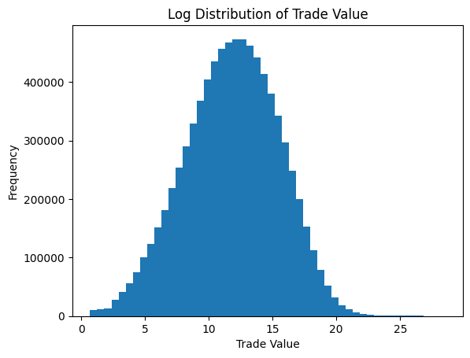
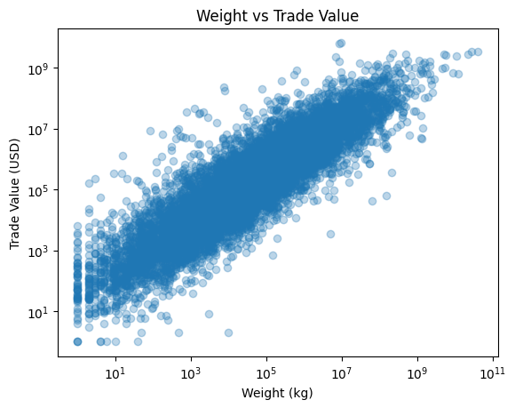
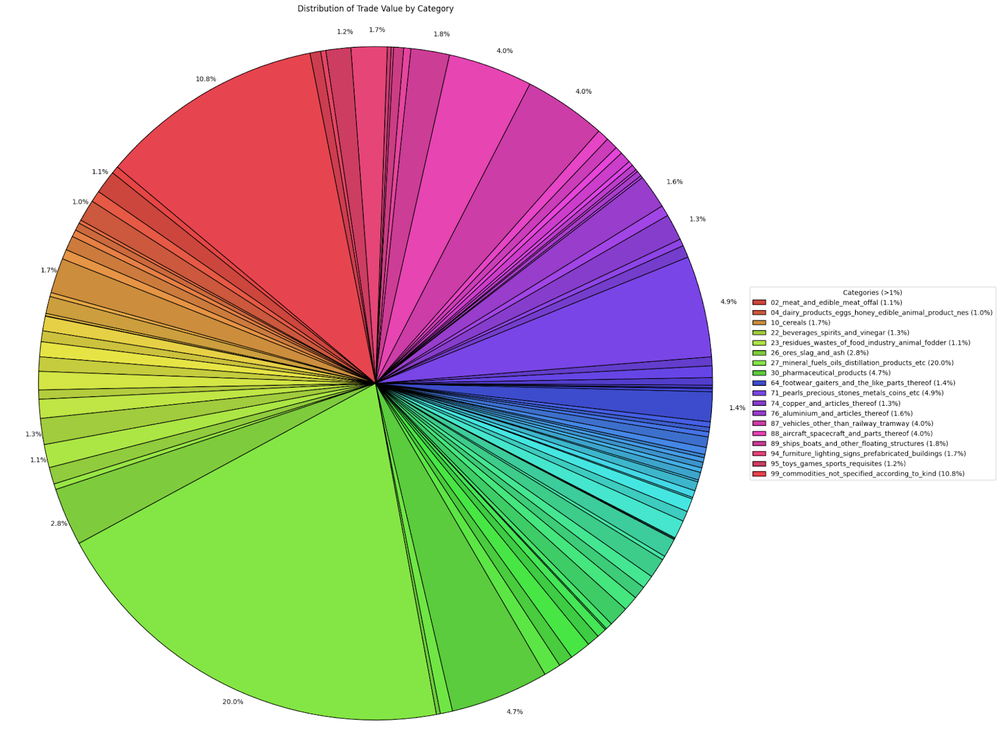
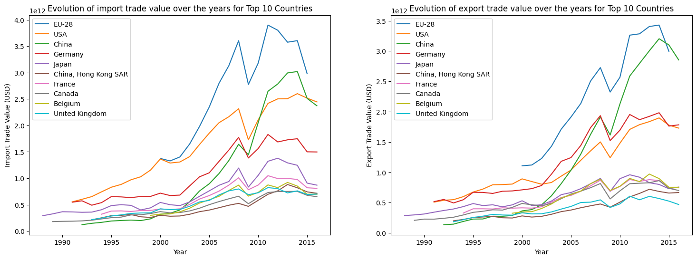

# COM-480 Milestone 1

## OP1: Visualizing 30 Years of Global Commodity Trade

## 1. Dataset

We will be using the Global Commodity Trade Statistics dataset published by the United Nations Statistics Division via Kaggle.

The dataset used for this project contains 8,225,871 records and 10 variables, covering international commodity trade between 1988 and 2016. It includes 209 reporting countries and 98 commodity categories, providing a comprehensive overview of global trade flows over nearly three decades.

Key variables include the reporting country (`country_or_area`), the traded commodity (`commodity` and `category`), the trade direction (`flow`, indicating import or export), the trade value in USD (`trade_usd`), and the physical quantity of goods (`weight_kg` and `quantity`).

The dataset is massive but complete and fairly organised. For a smooth web-based visualization, we will need to aggregate the data by region, decade, or specific high-interest categories (e.g., technology, agriculture, or fossil fuels) to reduce the file size and improve analysis.

## 2. Problematic

Over the three decades covered by this dataset (1988–2016), the world experienced massive macroeconomic shifts: the fall of the Soviet Union, the rise of China as a global manufacturing superpower, and the 2008 global financial crisis.

**Overview of the project:** We will focus on analyzing the trade relations between different countries and studying the reflection in world trade of different historical events, with their causes and consequences. We aim to create an interactive web experience that allows users to explore the evolution of global trade.

**Motivation:** Trade flows between countries over the years indirectly reflect a vast amount of information, from periods of war and prosperity to technological revolutions. This is why we believe that, despite this seemingly simple data, by applying what we've learned in this course and processing it appropriately, we can show and uncover many interesting conclusions.

**Target Audience:** Students, economics enthusiasts, and the general public interested in geopolitics.

## 3. Exploratory Data Analysis (EDA)

The dataset is largely complete. Most variables have no missing values, while `quantity` has ~3.7% missing (304,857 rows) and `weight_kg` ~1.56% (128,475 rows). Since core variables (country, year, trade_flow, trade_usd) are fully populated, these gaps do not materially affect overall analysis. Analyses involving physical quantities may require filtering or imputation.

Trade values (`trade_usd`) are highly skewed, with a few transactions accounting for very large volumes. A logarithmic transformation produces an approximately normal distribution, reflecting a wide range of transaction sizes from small trades to massive shipments.

Log-log plots of `weight_kg` vs. `trade_usd` show a clear positive correlation: larger shipments generally correspond to higher values. Variation across commodities is evident—raw materials or agricultural goods often have high weight but low value, whereas electronics or pharmaceuticals are high-value but low-weight. This highlights structural differences between commodity categories in global trade.

The top categories by trade value are: mineral fuels, oils, and distillation products (20%), commodities not specified according to kind (10.8%), pearls, precious stones, metals, and coins (4.9%), pharmaceutical products (4.7%), aircraft, spacecraft, and parts thereof (4%), and vehicles other than railway/tramway (4%). Further exploration will focus on the composition of commodities not specified according to kind.

Time-series plots for the top ten trading economies show strong growth from the early 1990s to mid-2010s. The EU-28 and the United States consistently dominate, while China exhibits rapid export growth from the early 2000s, reflecting its integration into global supply chains.

Overall, the dataset reveals strong global trade growth, large disparities between commodity weight and value, and the rising prominence of emerging economies, particularly China.

The exploration of the dataset can be found [here](../notebooks/data_exploring.ipynb).

## 4. Related Work

There are several existing platforms that visualize trade data. The Observatory of Economic Complexity (OEC), is one of the most well-known tools for visualizing global trade data. It uses visualizations such as interactive maps to show what products different countries export and how those exports relate to the global economy. One limitation, however, is that the platform mostly focuses on exploring current trade data rather than showing how trade patterns change over long periods of time. Our project takes inspiration from OEC’s interactive map design but focuses more on how trade relationships evolve over time. Using data from the last 30 years, we plan to include visualizations and animations that highlight shifts in countries’ exports and changes in global trade networks, with the goal of making these long-term trends easier to understand for a general audience.

Many Kaggle community notebooks perform exploratory data analysis on this dataset, often focusing on specific countries such as India or China and examining their trade growth using relatively simple visualizations like bar charts or static plots generated in Python. These projects are typically centered on analysis of a particular country or region. In contrast, our project focuses on identifying global trade patterns rather than isolating individual countries. Additionally, while Kaggle notebooks usually emphasize statistical analysis, our main goal is data visualization and accessibility.

We take inspiration from interactive map-based visualizations commonly used in data journalism and online dashboards. In particular, we plan to use Mapbox GL JS, which enables dynamic and visually rich maps (e.g., heatmaps, clustering, animations) similar to those seen on modern websites and magazines.